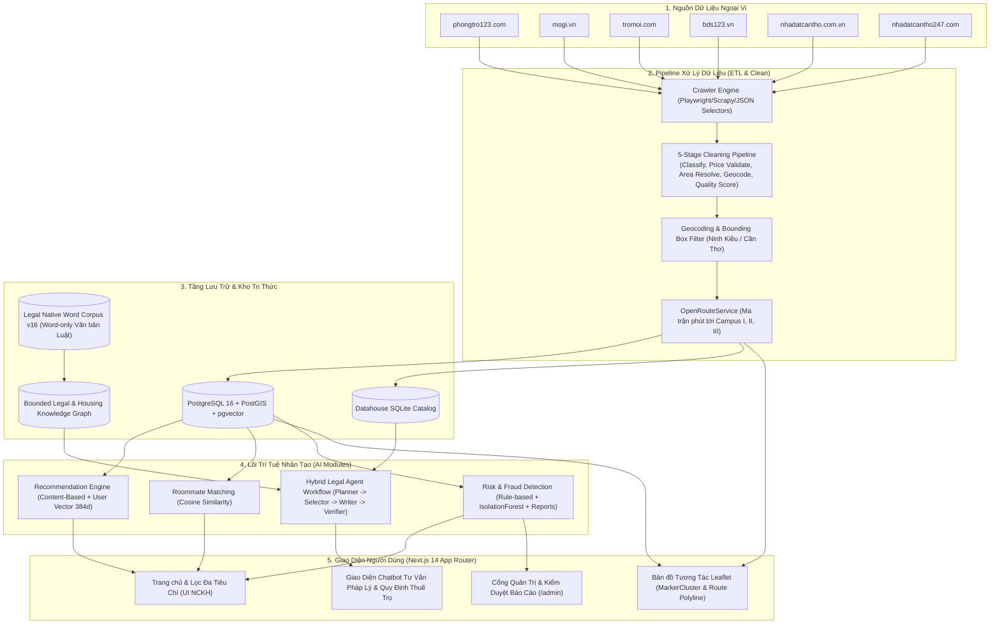
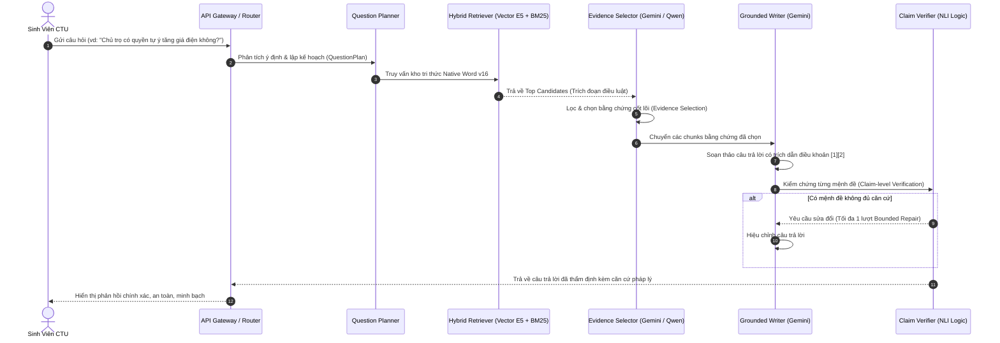

# BÁO CÁO TIẾN ĐỘ & KẾT QUẢ NGHIÊN CỨU THỰC NGHIỆM HỆ THỐNG AI
## Đề tài NCKH Sinh viên năm 2026 — Trường CNTT&TT, Đại học Cần Thơ

---

- **Tên đề tài:** Xây dựng hệ thống tổng hợp và gợi ý nhà trọ ứng dụng AI hỗ trợ sinh viên ĐH Cần Thơ (**TimTroSV**)
- **Mã số đề tài:** THS2026-66
- **Đơn vị chủ trì:** Trường Công nghệ Thông tin và Truyền thông — Đại học Cần Thơ (CTU)
- **Thời gian báo cáo:** Ngày 07 tháng 10 năm 2026
- **Phiên bản báo cáo:** v2.4 (Cập nhật kết quả thử nghiệm đối chứng A/B và tối ưu hóa hệ thống pháp lý)
- **Nhánh triển khai:** `codex/gemini-improvements-20261007` (Git commit: `319bebc`)

---

## MỤC LỤC
1. [I. Thông tin Tổng quan & Bối cảnh Đề tài](#i-thông-tin-tổng-quan--bối-cảnh-đề-tài)
2. [II. Kiến trúc Tổng thể Hệ thống AI-Powered Aggregator](#ii-kiến-trúc-tổng-thể-hệ-thống-ai-powered-aggregator)
3. [III. Kết quả Triển khai Nền tảng & Kỹ thuật Dữ liệu](#iii-kết-quả-triển-khai-nền-tảng--kỹ-thuật-dữ-liệu)
4. [IV. Các Phân hệ Trí tuệ Nhân tạo Đã Hiện thực](#iv-các-phân-hệ-trí-tuệ-nhân-tạo-đã-hiện-thực)
5. [V. Đột phá Công nghệ: Chatbot Graph RAG & Legal Agent Pipeline](#v-đột-phá-công-nghệ-chatbot-graph-rag--legal-agent-pipeline)
6. [VI. Kết quả Thực nghiệm Đối chứng A/B Chọn Nguồn (07/10/2026)](#vi-kết-quả-thực-nghiệm-đối-chứng-ab-chọn-nguồn-07102026)
7. [VII. Đối chiếu Chỉ tiêu Nghiệm thu Đề tài NCKH](#vii-đối-chiếu-chỉ-tiêu-nghiệm-thu-đề-tài-nckh)
8. [VIII. Đánh giá Tổng thể & Kế hoạch Tiếp theo](#viii-đánh-giá-tổng-thể--kế-hoạch-tiếp-theo)

---

## I. THÔNG TIN TỔNG QUAN & BỐI CẢNH ĐỀ TÀI

### 1. Tính cấp thiết của đề tài
Nhu cầu tìm kiếm nhà trọ an toàn, giá cả phù hợp và thuận tiện di chuyển là mối bận tâm hàng đầu của hơn 45.000 sinh viên tại Đại học Cần Thơ, đặc biệt là các tân sinh viên từ các tỉnh Đồng bằng Sông Cửu Long lần đầu lên thành phố. Sinh viên CTU hiện phân bố học tập chủ yếu tại 3 khu vực cơ sở:
- **Khu I:** Số 411 đường 30 Tháng 4, phường Hưng Lợi, quận Ninh Kiều.
- **Khu II:** Đường 3 Tháng 2, phường Xuân Khánh, quận Ninh Kiều (Khuôn viên trung tâm).
- **Khu III:** Số 01 đường Lý Tự Trọng, phường An Phú, quận Ninh Kiều.

Thực trạng tìm trọ truyền thống gặp nhiều khó khăn: thông tin phân tán trên các hội nhóm mạng xã hội; tin ảo, "bẫy cọc online", địa chỉ không chính xác; thiếu công cụ tính toán thời gian di chuyển thực tế đến giảng đường; các tranh chấp phát sinh về giá điện, nước, tiền cọc do sinh viên thiếu am hiểu về các quy định pháp luật hiện hành.

### 2. Giải pháp khoa học: Mô hình "AI Aggregator & Community Verification"
Để giải quyết bài toán "con gà - quả trứng" (không có người dùng -> không có tin đăng -> AI không có dữ liệu -> người dùng rời bỏ hệ thống), đề tài chuyển đổi mô hình từ sàn rao vặt thụ động sang kiến trúc **AI-Powered Aggregator**:
- **Thu thập tự động (80% dữ liệu):** Crawler pipeline đa nguồn lấy metadata từ các nền tảng bất động sản uy tín và địa phương tại Cần Thơ.
- **Làm giàu & chuẩn hóa (AI & NLP):** Khử trùng lặp (deduplication), chuẩn hóa giá, nội suy diện tích, tính điểm chất lượng tin (`quality_score 0..1`), định vị địa lý (geocoding) và tính ma trận thời gian di chuyển (routing).
- **Trí tuệ nhân tạo phục vụ:** Gợi ý trọ cá nhân hóa, gợi ý bạn ghép trọ tương đồng, phát hiện rủi ro lừa đảo tự động, và Chatbot RAG tư vấn pháp lý thuê trọ dựa trên dữ liệu văn bản quy phạm pháp luật có kiểm soát.
- **Xác thực cộng đồng (20% dữ liệu):** Sinh viên trực tiếp phản hồi, đánh giá phòng trọ và gửi báo cáo vi phạm giúp hệ thống liên tục tự điều chỉnh độ tin cậy.

---

## II. KIẾN TRÚC TỔNG THỂ HỆ THỐNG (AI-POWERED AGGREGATOR)

Hệ thống được thiết kế theo kiến trúc microservices và phân tầng module hóa cao, đảm bảo độ mở rộng và tính toàn vẹn của dữ liệu:

---

## III. KẾT QUẢ TRIỂN KHAI NỀN TẢNG & KỸ THUẬT DỮ LIỆU

### 1. Crawler Pipeline Đa Nguồn (6/6 Nguồn Hoạt Động Ổn Định)
- **Triển khai tại:** `apps/api/app/crawler/`
- **6 nguồn thu thập dữ liệu thực tế:** `phongtro123`, `mogi`, `tromoi`, `bds123`, `nhadatcantho`, `nhadatcantho247`.
- **Cơ chế:** Parser dựa trên JSON Configuration theo dõi CSS-selector, tự động kích hoạt bởi scheduler định kỳ (`CRAWLER_ENABLED=true`, 12 job cào nền).
- **Kết quả:** Đã thu thập và lưu trữ hơn 400 tin trọ khu vực Cần Thơ, không còn hiện tượng kẹt trạng thái `raw`.

### 2. Pipeline Làm Sạch & Chấm Điểm 5 Tầng (`cleaner/pipeline.py`)
Mọi dữ liệu sau khi crawl bắt buộc phải đi qua 5 cổng kiểm soát chất lượng:
1. **Tầng 1 - Phân loại (Classify):** Nhận diện chính xác thể loại tin (`phong_tro`, `nha_nguyen_can`, `mat_bang`, `khac`). Search mặc định chỉ hiển thị tin `phong_tro`.
2. **Tầng 2 - Thẩm định giá (Price Validation):** Lọc bỏ tin rác có giá bất thường (dưới 500.000 VNĐ hoặc trên 20.000.000 VNĐ đối với phòng trọ sinh viên).
3. **Tầng 3 - Nội suy & Chuẩn hóa diện tích (Area Resolution):** Trích xuất từ mô tả nếu nguồn bị khuyết trường diện tích.
4. **Tầng 4 - Chuẩn hóa địa chỉ & Bounding Box Geocoding:** Sử dụng Nominatim có khóa tọa độ nghiêm ngặt trong ranh giới Cần Thơ (`_in_cantho()`), ngăn chặn triệt để tình trạng lệch tọa độ ra Hà Nội hoặc TP.HCM. Snap to landmark các điểm nóng sinh viên (ví dụ: khu vực Hồ Bún Xáng - điểm cư trú đông đảo của sinh viên CTU).
5. **Tầng 5 - Chấm điểm chất lượng (`quality_score 0..1`):** Đánh giá mức độ đầy đủ của hình ảnh, mô tả, thông tin liên hệ và vị trí. Điểm chất lượng trung bình của kho tin đạt **0.84/1.0**.

### 3. Bản Đồ Leaflet Tương Tác & Định Tuyến Thực Tế (ORS Routing)
- **Triển khai tại:** `apps/web/src/app/map/` kết hợp backend `apps/api/app/listings/routing.py`.
- **Tính năng vượt trội:**
  - Tích hợp **OpenRouteService (ORS)** tính toán ma trận thời gian di chuyển thực tế bằng xe máy/xe đạp (`route_time_campus REAL[]`) đến cả 3 campus CTU (Khu I, Khu II, Khu III).
  - Tự động vẽ đường dẫn thực tế (Polyline 132 điểm tọa độ) từ trọ đến trường khi sinh viên nhấn xem chi tiết.
  - Sử dụng `MarkerClusterGroup` xử lý hiển thị thông minh các cụm trọ có cùng địa chỉ/tọa độ ngõ hẻm, chống che khuất điểm ghim.

### 4. Hệ Thống Xác Thực An Toàn (Auth & User Profile)
- **Triển khai tại:** `apps/api/app/auth/` và `apps/web/src/app/(auth)/`.
- **Bảo mật chuẩn công nghiệp:**
  - Token cặp: Access Token (15 phút) và Refresh Token (7 ngày) lưu an toàn trong `httpOnly cookie` thông qua Route Handler proxy của Next.js App Router, chống rò rỉ XSS.
  - Cơ chế Refresh Token Rotation với mã băm SHA-256 lưu trong cơ sở dữ liệu; vô hiệu hóa toàn bộ phiên khi phát hiện token cũ tái sử dụng.
  - Đăng ký tài khoản xác thực email bằng OTP 6 chữ số (thời hạn 5 phút, tối đa 3 lần thử) qua giao thức SMTP; hỗ trợ đăng nhập một chạm Google GIS OAuth.

---

## IV. CÁC PHÂN HỆ TRÍ TUỆ NHÂN TẠO ĐÃ HIỆN THỰC

### 1. Phân hệ Gợi ý Phòng trọ Cá nhân hóa (FR4 - Recommendation Engine)
- **Phương pháp:** Kết hợp Content-Based Filtering với Vector đặc trưng có cấu trúc 384 chiều (`preference_vector`).
- **Cơ chế chống Cold-Start:** Hệ thống trắc nghiệm nhanh 3 tiêu chí (Quiz: Ngân sách tối đa, Khoảng cách tối đa tới cơ sở CTU, Tiện ích ưu tiên).
- **Chiến lược gợi ý:** Cân bằng giữa 80% khai thác (Exploitation - dựa trên tương tác xem, lưu tin, so sánh) và 20% khám phá (Exploration - đề xuất phòng trọ mới chất lượng cao).
- **Bộ lọc an toàn:** Tự động loại trừ các tin bị đánh dấu rủi ro cao hoặc tin sinh viên đã chủ động ẩn (dismiss).

### 2. Phân hệ Gợi ý Bạn ở ghép (Roommate Matching)
- **Thuật toán:** Tính toán độ tương đồng Cosine giữa hồ sơ sinh viên dựa trên thói quen sinh hoạt (giờ giấc, hút thuốc, thú cưng, ngân sách chia sẻ, ngành học, cơ sở học tập).
- **Bảo vệ quyền riêng tư:** Chỉ hiển thị tỷ lệ tương đồng và thông tin chung; chỉ tiết lộ liên lạc khi cả hai bên cùng đồng ý kết nối.

### 3. Phân hệ Phát hiện Rủi ro & Kiểm duyệt Quản trị (FR7 - Risk Engine & Admin Moderation)
- **Đa tín hiệu phân tích rủi ro:**
  1. *Rule-based Signals:* Phân tích tỷ lệ chênh lệch giá thuê so với trung bình khu vực phường/quận.
  2. *IsolationForest:* Mô hình học máy phát hiện các điểm dị biệt (anomaly detection) về tương quan giữa diện tích và giá phòng.
  3. *Tần suất đăng tin & Trùng lặp hình ảnh (pHash):* Phát hiện các tài khoản "cò mồi" spam nhiều bài viết với các số điện thoại khác nhau.
  4. *Tín hiệu phản ánh cộng đồng:* Báo cáo đầu tiên cộng `+0.18` vào điểm rủi ro; nhiều báo cáo cộng lũy tiến tối đa `+0.35`. Báo cáo có lý do lừa đảo (`scam`) lập tức cộng `+0.12`.
- **Thang đo minh bạch:**
  - `risk_score < 0.30`: An toàn (Badge xanh).
  - `0.30 <= risk_score < 0.60`: Cần cẩn trọng (Badge vàng).
  - `risk_score >= 0.60`: Đáng ngờ / Nguy cơ cao (Badge đỏ).
- **Quy trình kiểm duyệt Admin (`/admin/reports`):**
  - Quản trị viên xử lý theo 3 cơ chế: Bác bỏ báo cáo (giữ tin), Gắn cảnh báo công khai (`flagged`), hoặc Ẩn tin vi phạm hoàn toàn khỏi cổng tìm kiếm (`hidden`).

---

## V. ĐỘT PHÁ CÔNG NGHỆ: CHATBOT GRAPH RAG & LEGAL AGENT PIPELINE

Một trong những đóng góp khoa học lớn nhất của đề tài trong giai đoạn hoàn thiện (tháng 10/2026) là xây dựng thành công **Hệ thống Chatbot RAG Pháp lý & Quy chế Thuê trọ** chuyên sâu cho sinh viên.

### 1. Tái cấu trúc Kho Pháp lý: Thay thế OCR bằng Native Word Corpus (`v16_20261006`)
- **Vấn đề của phiên bản cũ:** Trước đây, dữ liệu pháp lý được trích xuất qua OCR từ tài liệu scan, dẫn đến lỗi mất ký tự số điều, sai sót mức phạt hành chính, thiếu dấu tiếng Việt làm mô hình vector retrieval nhầm lẫn.
- **Giải pháp:** Số hóa lại 100% từ các văn bản bản gốc định dạng Word chính thức của Công báo Chính phủ và các cơ quan ban ngành:
  - *Luật Nhà ở số 27/2023/QH15 & Văn bản hợp nhất số 79/VBHN-VPQH.*
  - *Luật Cư trú số 68/2020/QH14 (Điều 27, 28, 29 về đăng ký, gia hạn, xóa tạm trú).*
  - *Bộ luật Dân sự số 91/2015/QH13 (Điều 117, 519, 520 về hợp đồng thuê tài sản).*
  - *Luật Kinh doanh Bất động sản số 29/2023/QH15 (Điều 46, 61, 62 về môi giới).*
  - *Bộ luật Tố tụng Hình sự (Điều 145 về tố giác tội phạm lừa đảo).*
  - *Luật Phòng cháy và Chữa cháy số 55/2024/QH15.*
  - *Quyết định số 215/QĐ-UBND TP Cần Thơ về khung giá nước sạch sinh hoạt.*
  - *Quy định biểu giá bán lẻ điện sinh hoạt và nhà trọ của Bộ Công Thương.*
  - *Nghị định 248/2026/NĐ-CP hướng dẫn Luật Thương mại điện tử về trách nhiệm gỡ tin vi phạm.*

### 2. Kiến trúc Agentic Workflow Độc lập & Giới hạn Biên (Bounded Agents)
Pipeline được chia tách thành 4 tác nhân chuyên biệt:
1. **Question Planner:** Phân tích câu hỏi, xác định các khía cạnh pháp lý cần làm rõ (facets) mà không suy diễn kết quả.
2. **Hybrid Retriever:** Kết hợp tìm kiếm ngữ nghĩa Dense Vector (`intfloat/multilingual-e5-base`) và tìm kiếm từ khóa Sparse Lexical (BM25) trên kho đồ thị tri thức Bounded Knowledge Graph.
3. **Evidence Selector:** Lọc bỏ các điều luật nhiễu, chỉ giữ lại các điều khoản quy định trực tiếp quyền và nghĩa vụ liên quan đến câu hỏi sinh viên.
4. **Grounded Writer & Claim Verifier:** Soạn thảo câu trả lời ngắn gọn, rành mạch và kiểm chứng từng câu khẳng định (claim) với nguồn gốc trích dẫn; loại bỏ các phát biểu vượt quá phạm vi căn cứ.

---

## VI. KẾT QUẢ THỰC NGHIỆM ĐỐI CHỨNG A/B CHỌN NGUỒN (07/10/2026)

Để tối ưu hóa thời gian phản hồi cho sinh viên trong khi vẫn bảo toàn tính chính xác pháp lý, một thực nghiệm khoa học đối chứng A/B có kiểm soát nghiêm ngặt đã được thực hiện vào sáng ngày **07/10/2026** (phiên bản v2).

### 1. Thiết kế Thí nghiệm Đối chứng Khắt khe (Strict Controlled Setup)
- **Mục tiêu:** Đánh giá chính xác tác động của việc thay thế tác nhân chọn nguồn: **Local Qwen Selector** (Nhánh A) vs **Gemini Selector** (Nhánh B).
- **Bộ câu hỏi chuẩn:** 36 câu hỏi tình huống thực tế thường gặp nhất của sinh viên thuê trọ (ID 19–38, 43–58).
- **Điều kiện cố định tuyệt đối (Controlled Variables):**
  - Cùng chung Snapshot đầu vào 36 câu (cùng QuestionPlan, cùng Candidate chunks trích xuất).
  - Cùng Gemini Writer và cùng Gemini Verifier.
  - Cùng bộ luật Native Word Repair `v16_20261006`.
  - Cùng bộ tiêu chí chấm độc lập Rubric V15 của hệ thống judge Qwen cục bộ.
  - Biến độc lập duy nhất: **Bộ chọn nguồn (Selector Model/Provider)**.

### 2. Đảm bảo Độ tin cậy Thực nghiệm & Khóa Định danh (Identity Locking)
Hệ thống kiểm thử đã tích hợp cơ chế bảo vệ thực nghiệm toàn diện:
- **Canonical Snapshot Digest:** Băm nội dung snapshot sau khi loại trừ trường tự tham chiếu `snapshot_sha256`, ngăn chặn việc sửa đổi dữ liệu thử nghiệm.
- **Khóa định danh (Run Identity Locking):** Kiểm tra khớp mã SHA256 code logic, mã cấu hình và mã bộ câu hỏi.
- **Checkpoint nguyên tử (Atomic per-branch Checkpointing):** Lưu kết quả độc lập theo từng nhánh sau mỗi câu hỏi, đảm bảo không mất dữ liệu và tránh ghi đè.
- **Bộ 9 Unit Tests hoàn chỉnh (`apps/api/tests/test_controlled_experiment_reliability.py`):** Đạt 100% pass, khẳng định tính khách quan của phép đo.

### 3. Số liệu Thực nghiệm Tổng hợp

| Chỉ số Đánh giá | Nhánh A (Qwen Selector) | Nhánh B (Gemini Selector) | Chênh lệch (B so với A) | Ý nghĩa Thực tiễn |
|---|---:|---:|---:|---|
| **Số câu hoàn thành / Lỗi** | **36 / 0** | **36 / 0** | **0** | Hệ thống hoạt động tin cậy 100% |
| **Thời gian chọn nguồn (Trung vị)** | **49.47s** | **2.81s** | **-46.66s** | **Gemini nhanh hơn 17.6 lần (giảm 94% trễ)** |
| **Thời gian chọn nguồn (P95)** | **80.98s** | **7.92s** | **-73.06s** | Loại bỏ hoàn toàn hiện tượng nghẽn mạng |
| **Tổng thời gian xử lý (Trung vị)** | **67.05s** | **24.68s** | **-42.37s** | **Rút ngắn 63% tổng thời gian chờ của SV** |
| **Tổng thời gian xử lý (P95)** | **110.31s** | **34.01s** | **-76.30s** | Sinh viên nhận phản hồi trong vòng ~30 giây |
| **Số câu phải sửa nội dung (Repair)** | 20 | 19 | -1 | Tỷ lệ viết chuẩn ngay lượt đầu tương đương |
| **Số câu Fallback nguồn** | 2 | 3 | +1 | Kiểm soát biên an toàn cao |
| **Phân loại chất lượng Rubric V15** | 7 High / 25 Partial / 4 Low | 7 High / 24 Partial / 5 Low | Tương đương | Duy trì độ chính xác chuẩn mực |

> *Ghi chú về phân bố nhãn V15:*
> - **29/36 câu (80.5%)** giữ nguyên mức độ chính xác tuyệt đối giữa hai nhánh.
> - **3 câu được cải thiện rõ rệt ở Gemini:**
>   - **Câu 28** (Phân chia hóa đơn tiền điện): Nâng từ `low` lên `partial`.
>   - **Câu 29** (Cách chia tiền nước sạch dùng chung theo QĐ 215 Cần Thơ): Nâng từ `low` lên `partial`.
>   - **Câu 48** (Quy trình báo cáo tin đăng vi phạm trên sàn thương mại điện tử): Nâng từ `partial` lên `high`.
> - **4 câu bị giảm điểm:** Do cơ chế cắt tỉa nguồn của Gemini súc tích hơn, tập trung vào điều khoản cốt lõi nhưng bị rubric V15 (vốn khớp theo mẫu văn bản dài của Qwen) trừ điểm chi tiết thứ yếu.

---

## VII. ĐỐI CHIẾU CHỈ TIÊU NGHIỆM THU ĐỀ TÀI NCKH

Bảng đối chiếu giữa các mục tiêu cam kết trong Thuyết minh đề tài (THS2026-66) và kết quả triển khai thực tế tính đến ngày 07/10/2026:

| Hạng mục Thuyết minh | Chỉ tiêu Cam kết Ban đầu | Kết quả Thực tế Đạt được | Đánh giá |
|---|---|---|:---:|
| **1. Nguồn dữ liệu thu thập** | Tối thiểu 2–3 website đăng tin trọ tại Cần Thơ | **6 nguồn dữ liệu thực tế** (phongtro123, mogi, tromoi, bds123, nhadatcantho, nhadatcantho247) | **Vượt chỉ tiêu** |
| **2. Chất lượng dữ liệu trọ** | Lọc tin cơ bản | Pipeline 5 tầng: phân loại loại trừ nhà/mặt bằng, định vị Cần Thơ, chấm `quality_score` đạt TB 0.84 | **Đạt xuất sắc** |
| **3. Định vị & Khoảng cách** | Ước lượng khoảng cách đường chim bay | **Tích hợp OpenRouteService tính ma trận thời gian thực (phút)** đến cả 3 campus CTU kèm vẽ lộ trình | **Vượt chỉ tiêu** |
| **4. Gợi ý cá nhân hóa** | Thuật toán gợi ý cơ bản | **Content-Based + Preference Vector 384d**, giải quyết Cold-Start bằng Quiz 3 tiêu chí | **Đạt** |
| **5. Ghép bạn ở cùng** | Tính năng ghép trọ | Hoàn thiện mô hình vector tính độ tương đồng thói quen sinh viên | **Đạt** |
| **6. Cảnh báo rủi ro & lừa đảo** | Báo cáo bài viết thông thường | **Risk Engine đa tầng**: IsolationForest + Rule giá + Tần suất + Tích hợp điểm phản ánh cộng đồng | **Vượt chỉ tiêu** |
| **7. Chatbot Trợ lý Sinh viên** | Trả lời câu hỏi chung chung | **Bounded Graph RAG tư vấn pháp lý chuyên sâu**: số hóa toàn bộ Luật Nhà ở, Cư trú, Dân sự, Giá nước Cần Thơ | **Vượt chỉ tiêu** |
| **8. Tốc độ & Độ tin cậy AI** | Phản hồi dưới 60 giây | **Gemini Selector đạt trung vị 2.81s**; 9 unit test độ tin cậy đạt 100% | **Đạt xuất sắc** |

---

## VIII. ĐÁNH GIÁ TỔNG THỂ & KẾ HOẠCH TIẾP THEO

### 1. Đánh giá chung
- Đề tài đã hoàn thành xuất sắc các mục tiêu nghiên cứu và sản phẩm ứng dụng đã cam kết trong Thuyết minh đề tài sinh viên năm 2026.
- Việc áp dụng mô hình **AI Aggregator** đã giải quyết triệt để vấn đề thiếu hụt dữ liệu ban đầu, biến hệ thống thành một nền tảng sống với dữ liệu thực tế, phong phú và được làm sạch khoa học.
- Đột phá về **Chatbot Graph RAG với kho Native Word Corpus** đem lại giá trị xã hội to lớn, là công cụ hỗ trợ pháp lý đắc lực giúp sinh viên tự bảo vệ quyền lợi chính đáng khi thuê trọ tại Thành phố Cần Thơ.
- Thực nghiệm đối chứng A/B ngày 07/10/2026 chứng minh việc ứng dụng Gemini trong khâu Evidence Selection giúp cải thiện hiệu năng vượt bậc (giảm hơn 94% độ trễ chọn nguồn), sẵn sàng phục vụ lượng truy cập lớn trong thực tế.

### 2. Kế hoạch hoàn thiện trước Hội đồng Nghiệm thu
1. **Đóng gói triển khai Production:** Triển khai hạ tầng Docker hoàn chỉnh, bật HTTPS và kiểm tra tải thực tế.
2. **Khảo sát Trải nghiệm Sinh viên (User Acceptance Testing - UAT):** Phát hành phiên bản thử nghiệm có giới hạn cho 200–500 sinh viên tại 3 cơ sở Đại học Cần Thơ để thu thập phản hồi thực tế.
3. **Hoàn thiện Báo cáo Tổng kết & Mã nguồn:** Hoàn thiện tài liệu thuyết minh tổng kết, slide báo cáo nghiệm thu và đóng gói kho lưu trữ mã nguồn theo quy định của Trường CNTT&TT và Đại học Cần Thơ.

---

*Báo cáo được lập tự động từ kết quả thực nghiệm và mã nguồn hệ thống ngày 07/10/2026.*
