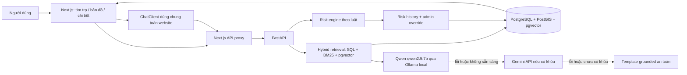

# Hướng dẫn tích hợp AI Chat + Risk vào hệ thống Trọ CTU

## 1. Kiến trúc sau tích hợp



Chatbot và risk không còn là ứng dụng tách rời:

- `ChatClient` được render ở layout gốc, nên xuất hiện trên trang chủ, bản đồ, chi tiết và các trang tài khoản.
- `POST /chat/ask` và các route `/risk/*` được đăng ký trong FastAPI chính.
- Risk được tự chấm khi người dùng tạo/sửa tin và có thể nhận dữ liệu đã ingest từ pipeline khác. `risk_score`, `risk_level`, `risk_status` và `risk_reasons` dùng chung cho card, bản đồ và trang chi tiết. UGC mức suspicious bị chuyển `flagged` để admin duyệt.
- Chatbot truy xuất đúng bảng `aggregated_listings` mà list/map đang sử dụng.

## 2. Chế độ model

Biến `CHATBOT_LLM_PROVIDER` nhận một trong bốn giá trị:

| Giá trị | Hành vi |
|---|---|
| `auto` | Qwen local → Gemini nếu có khóa → template |
| `qwen` | Qwen local → template |
| `gemini` | Gemini → template |
| `template` | Không gọi LLM, chỉ dùng mẫu grounded |

Mặc định là `auto`. Model Qwen đã xác nhận trên máy phát triển là `qwen2.5:7b`.

Qwen/Gemini chỉ sinh câu trả lời sau khi backend đã lọc và xếp hạng tối đa 5 tin. Prompt buộc model chỉ dùng context, trích dẫn theo `[1]`–`[5]` và không tự tạo giá, địa chỉ, tiện ích hoặc mức rủi ro.

## 3. Cấu hình `.env`

Không ghi khóa thật vào source code hoặc `.env.example`. File `.env` đã nằm trong `.gitignore`.

```dotenv
CHATBOT_LLM_PROVIDER=auto
CHATBOT_LLM_TIMEOUT_SECONDS=120
CHATBOT_CONFIDENCE_THRESHOLD=0.65
CHATBOT_MAX_RESULTS=5

OLLAMA_BASE_URL=http://localhost:11434
OLLAMA_DOCKER_BASE_URL=http://host.docker.internal:11434
OLLAMA_MODEL=qwen2.5:7b

# Điền sau khi có khóa từ Google AI Studio
GEMINI_API_KEY=
GEMINI_MODEL=gemini-3.7-flash

RISK_AUTO_ASSESS=true
RISK_AUTO_ASSESS_LIMIT=1000
```

Khi bạn cung cấp khóa Gemini, chỉ cần đặt giá trị vào `GEMINI_API_KEY` trong `.env`, không gửi khóa vào frontend. Backend gửi khóa bằng header `x-goog-api-key` theo tài liệu chính thức của Google.

Muốn kiểm tra riêng Gemini, đặt:

```dotenv
CHATBOT_LLM_PROVIDER=gemini
```

Muốn ưu tiên Qwen và chỉ dùng Gemini khi Qwen lỗi, giữ `auto`.

## 4. Chuẩn bị Qwen local

Kiểm tra model:

```powershell
ollama list
```

Kết quả phải có `qwen2.5:7b`. Nếu Ollama chưa chạy:

```powershell
ollama serve
```

Thử trực tiếp:

```powershell
ollama run qwen2.5:7b "Trả lời ngắn bằng tiếng Việt: xin chào"
```

API chạy trực tiếp trên Windows gọi `OLLAMA_BASE_URL=http://localhost:11434`. API chạy trong Docker gọi `OLLAMA_DOCKER_BASE_URL=http://host.docker.internal:11434`.

## 5. Áp database migration

Với database volume đang tồn tại, chạy migration cộng thêm, không xóa dữ liệu:

```powershell
docker compose up -d db
& .\.venv\Scripts\python.exe scripts\apply_room_services.py
```

Bảy migration cộng thêm được áp theo thứ tự 90–96:

- `90_chatbot.sql`: metadata embedding và index candidate.
- `91_room_service_risk.sql`: model/thời điểm đánh giá risk và index pending.
- `92_reports_moderation.sql`: báo cáo cộng đồng và kiểm duyệt.
- `93_ai_product_features.sql`: feedback/telemetry, lịch sử risk, favorites, saved search, notifications và evaluation runs.
- `94_legal_knowledge.sql`: kho văn bản và đoạn trích pháp lý.
- `95_fr_delivery.sql`: vòng đời tài khoản, phiên refresh và cấu hình gợi ý.
- `96_reviews_sentiment.sql`: đánh giá sao và hàng chờ kiểm duyệt cảm xúc.

Database tạo mới từ image tự chạy toàn bộ migration. Không dùng `docker compose down -v` trừ khi thực sự muốn xóa toàn bộ dữ liệu.

## 6. Chạy hệ thống hợp nhất

Đảm bảo Ollama đang chạy trên máy host, sau đó:

```powershell
docker compose up -d --build db redis api web
```

Mở:

- Website: `http://localhost:3000`
- Trang chat: `http://localhost:3000/chat`
- Bản đồ: `http://localhost:3000/map`
- API docs: `http://localhost:8000/docs`
- Trạng thái AI: `http://localhost:8000/health/ai`

`/health/ai` không trả về API key. Trạng thái Qwen mong đợi:

```json
{
  "provider_mode": "auto",
  "qwen": {"status": "ok", "model": "qwen2.5:7b"},
  "gemini": {"configured": false, "model": "gemini-3.7-flash"}
}
```

## 7. Kiểm tra chat

```powershell
$body = @{ message = "Tìm phòng dưới 2 triệu gần CTU có wifi" } | ConvertTo-Json
Invoke-RestMethod -Method Post -Uri http://localhost:8000/chat/ask -ContentType application/json -Body $body
```

Các trường cần kiểm tra:

- `generation_provider`: `qwen-local`, `gemini` hoặc `template`.
- `generation_model`: model thực tế đã dùng.
- `sources` và `listings`: tối đa 5 tin.
- `degraded=true`: một tầng AI không sẵn sàng và hệ thống đã fallback.
- `retrieval_mode`: `hybrid`, `lexical_structured` hoặc `rule`.
- `citation_accuracy`: kiểm tra định dạng citation theo nguồn đã retrieval; không thay thế RAGAS faithfulness.

## 8. Kiểm tra risk

Xem trước risk của một tin, không ghi DB:

```powershell
Invoke-RestMethod http://localhost:8000/risk/listings/1
```

Chấm và lưu một tin hoặc batch cần token admin:

```text
POST /risk/listings/{listing_id}/assess
POST /risk/assess-pending?limit=1000
Authorization: Bearer <admin-access-token>
```

Admin có thêm lịch sử/override có audit trail:

```text
GET /risk/listings/{listing_id}/history
PUT /risk/listings/{listing_id}/override
```

Khi `RISK_AUTO_ASSESS=true`, thao tác tạo/sửa tin và crawler đã tự chạy risk; không cần gọi batch thường xuyên.

## 9. Embedding semantic tùy chọn

Qwen dùng để sinh câu trả lời. Tìm kiếm vector vẫn dùng `intfloat/multilingual-e5-small` 384 chiều. Nếu không cài E5, chatbot vẫn chạy bằng SQL filter + BM25 và trả `degraded=true`.

Để tạo embedding thật ngoài container:

```powershell
& .\.venv\Scripts\python.exe -m pip install -r apps\api\requirements-ml.txt
& .\.venv\Scripts\python.exe scripts\index_listing_embeddings.py --model intfloat/multilingual-e5-small
```

## 10. Kiểm thử

```powershell
& .\.venv\Scripts\python.exe -m pytest apps\api\tests\test_chatbot.py apps\api\tests\test_chatbot_dataset.py apps\api\tests\test_risk.py apps\api\tests\test_engagement.py -q
& .\.venv\Scripts\python.exe eval\chatbot_eval.py
Set-Location apps\web
npx tsc --noEmit --incremental false
```

Integration test PostgreSQL cần Docker và migration đã áp:

```powershell
& .\.venv\Scripts\python.exe -m pytest apps\api\tests\test_chatbot_integration.py -q
```

Đánh giá Faithfulness/Answer Relevancy phải chạy `eval/ragas_eval.py` trên API thật. Quy trình provenance, nhãn độc lập và nguồn bài báo nằm tại `eval/README.md`.

## 11. Lưu ý bảo mật và vận hành

- Không đưa `GEMINI_API_KEY` vào `NEXT_PUBLIC_*`, source code, ảnh chụp hoặc Git.
- Hạn chế Gemini key cho đúng Gemini API trong Google AI Studio/Google Cloud.
- Qwen local giữ prompt/context trên máy; Gemini chỉ nhận câu hỏi và tối đa 5 listing đã truy xuất khi được dùng.
- Câu trả lời AI không thay thế việc xác minh chủ trọ, xem phòng, hợp đồng và kiểm tra trước khi đặt cọc.
- Tài liệu API tham khảo: [Gemini API key](https://ai.google.dev/gemini-api/docs/generate-content/api-key), [Ollama chat API](https://docs.ollama.com/api/chat).
