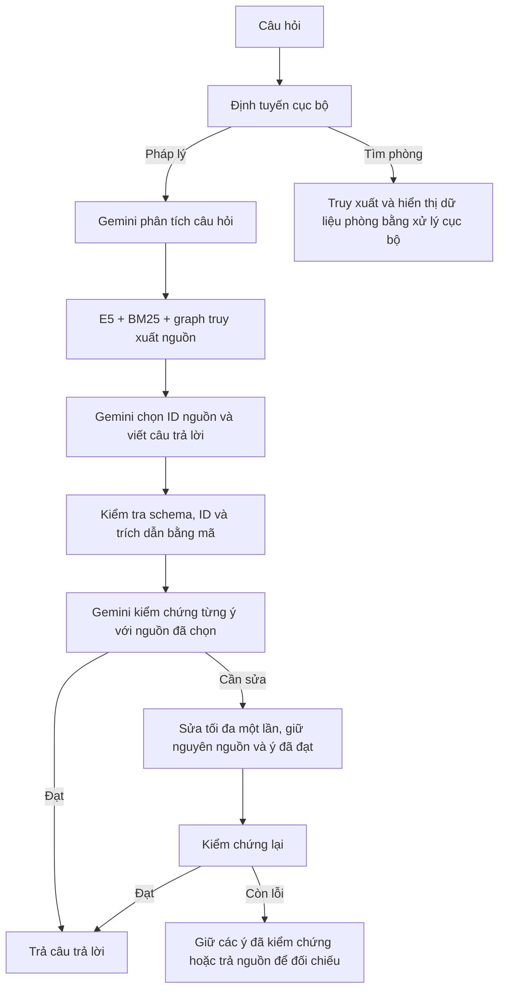

# Gemini chọn nguồn và tổng hợp RAG

Kết quả thử hoàn chỉnh: [GEMINI_LEGAL_TEST_RESULTS.md](GEMINI_LEGAL_TEST_RESULTS.md).
Luồng combined hiện là lựa chọn thử nghiệm; mặc định vẫn là Qwen/separate do
kết quả khớp mẫu V15 của lượt combined thấp hơn lượt Qwen đã lưu.

## Luồng thực thi



`combined` dùng một request cho bước chọn nguồn và viết; phân tích và kiểm chứng
vẫn là các request riêng. Với câu trả lời đạt ngay, có ba bước gọi Gemini.
Một lần sửa nội dung có thể thêm một request viết và một request kiểm chứng.
JSON sai schema được thử sửa tối đa một lần ở bước sinh ban đầu.

Chế độ `separate` gọi Gemini chọn ID trước, sau đó Gemini viết từ nguồn được chọn.
Chế độ Qwen cũ vẫn có thể chọn lại để so sánh/khôi phục. Trong hai chế độ Gemini,
router không tạo hoặc warmup Ollama; Qwen chỉ còn được dùng khi chủ động chọn chế độ
cũ hoặc chạy bộ chấm cục bộ.

Nguồn được lấy từ corpus, không do Gemini tự tìm URL hay tự tạo. ID không tồn tại,
ID trùng, ID sai kiểu, trích dẫn ngoài tập đã chọn đều bị từ chối. Mã hiện có vẫn
bổ sung đơn vị nguồn truy xuất cho ý còn thiếu và giữ điều kiện hiệu lực. Nếu không
có nguồn thích hợp, hệ thống trả thiếu căn cứ. Lỗi proxy không âm thầm gọi Qwen.

Kiểm chứng dùng cùng model cấu hình nhưng ở request và prompt riêng; đây không phải
hai model độc lập. Kết quả kiểm chứng nội bộ không thay thế việc xác minh văn bản
pháp luật còn hiệu lực. Các cảnh báo về bản Word/trích tuyển tiếp tục được giữ.

## Cấu hình

| Biến | Mặc định | Ý nghĩa |
|---|---|---|
| `CHATBOT_LEGAL_SELECTION_PROVIDER` | `qwen` | `qwen` hoặc `gemini` |
| `CHATBOT_LEGAL_GENERATION_MODE` | `separate` | `separate` hoặc `combined` |
| `CHATBOT_LEGAL_SELECTION_MODEL` | trống | Model chọn nguồn; combined ưu tiên model này cho cả chọn và viết |
| `CHATBOT_LEGAL_SELECTION_TIMEOUT_SECONDS` | 60 | Timeout bước chọn riêng |
| `CHATBOT_ANSWER_SYNTHESIS_TIMEOUT_SECONDS` | 60 | Timeout bước viết hoặc chọn + viết |

Combined yêu cầu agents, synthesis và Gemini selector cùng bật. Cấu hình sai dừng
ngay khi khởi tạo. Proxy và khóa dùng cấu hình Gemini đang có. Không ghi khóa vào
source hoặc báo cáo. Tên model trong báo cáo là alias do proxy nhận, không phải
xác nhận model gốc phía sau proxy.

`docker-compose.gemini-legal.yml` là overlay bật Gemini combined cho API và eval.
Cần thêm sau các overlay corpus đang sử dụng và rebuild/recreate API để áp dụng.
Chỉ sửa file không làm container API hiện có tự cập nhật. Bỏ overlay này và dùng
`CHATBOT_LEGAL_SELECTION_PROVIDER=qwen`, `CHATBOT_LEGAL_GENERATION_MODE=separate`
để trở về luồng cũ khi dựng lại dịch vụ.

## Chạy thử lại

Từ thư mục gốc, dùng PowerShell:

```powershell
./scripts/test_gemini_legal.ps1 -Mode combined -RunName ten-lan-thu-moi -Preflight
./scripts/test_gemini_legal.ps1 -Mode combined -RunName ten-lan-thu-moi
./scripts/test_gemini_legal.ps1 -Mode separate -RunName ten-lan-thu-rieng-moi
```

Mặc định chạy 36 câu: 19–38 và 43–58. Có thể dùng `-Ids 19,30,55` cho pilot.
Script dùng corpus sửa v16, ghi báo cáo mới dưới `eval/reports`, không khởi động lại
API chính, không mount thư mục Datehouse. Ranh giới `--legal-only` chặn truy xuất
nhà trọ và kiểm tra cặp document/chunk thuộc corpus trước các bước gọi cloud.

Pipeline hash, corpus hash, câu hỏi, model, chế độ được lưu để chặn tiếp tục một
checkpoint với cấu hình khác. Giữ nguyên báo cáo cũ; đổi RunName nếu đổi đầu vào.
Nếu gặp quota, runner giữ checkpoint và dừng theo cơ chế hiện có.

Để so độ khớp nội dung với bộ đáp án đã lưu, dùng nguyên
`eval/compare_grounded_references.py` (rubric v15) và `quantity_audit.py`.
Bộ chấm chạy Qwen cục bộ, không gửi đáp án mẫu lên Gemini. Nhãn high/partial/low
đo độ khớp văn bản; không phải phần trăm đúng luật. Báo cáo runtime tách riêng số
câu thiếu căn cứ, số lần sửa, trích dẫn, độ trễ và lỗi gọi dịch vụ.

## Mã chính

- `gemini_selection.py`: chọn ID, ràng buộc nguồn, luồng combined và giới hạn thử lại.
- `agent_workflow.py`: dùng chung prompt viết, renderer và sửa có giữ ý đã kiểm chứng.
- `router.py`: chọn provider và chế độ theo cấu hình.
- `legal_only_boundary.py`: kiểm tra nguồn trước các entrypoint cloud trong eval.
- `test_gemini_selection.py`: ID sai, nguồn ngoài tập, thiếu nguồn, lỗi proxy,
  sửa tối đa một lần, không khởi tạo Qwen, ranh giới dữ liệu pháp lý.

Kết quả đo thực tế được ghi riêng trong báo cáo thử nghiệm, không suy ra hiệu quả
chỉ từ việc giảm số request.
