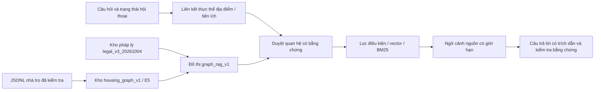

# Graph RAG với kho nhà trọ riêng — 04/10/2026

Nhánh thử nghiệm: `codex/graph-rag-datahouse-20261004`, trên GitHub cá nhân `phucbeo223/Local-Project-For-Student-Room`. Bước 2 được triển khai vì lần kiểm thử trước có truy xuất pháp lý đủ 36 câu, kho nhà trọ nạp đầy đủ và các điểm yếu có thể đo tiếp. Đây chưa phải kết luận đạt chất lượng triển khai thực tế.

## Pipeline đang triển khai



Đồ thị dùng PostgreSQL hiện có. Bản ghi nhà trọ nối tới quận, địa điểm nêu rõ ở tiêu đề/địa chỉ, tiện ích có cờ `true` và khoảng cách ước tính đến CTU khu II. Quan hệ giữ ID bản ghi, trường nguồn và SHA-256 của catalog. Không suy ra sức chứa, đồng ý ở ghép, phòng còn trống, rủi ro hay thời gian đi đường.

Với truy vấn địa điểm như “đường 3/2 hoặc Xuân Khánh”, graph duyệt cạnh `located_in` để chọn tập ứng viên, sau đó vẫn áp dụng mọi điều kiện giá/diện tích/tiện ích bằng SQL. Các địa điểm thay thế là OR; các tiện ích là AND. Quan hệ và trường nguồn được đưa vào context Qwen, có trace trong kết quả. Điều kiện địa điểm có bằng chứng được tính một lần theo trọng số bộ lọc hiện có; confidence vẫn là heuristic chưa hiệu chuẩn.

Đồ thị pháp lý nối đơn vị điều/khoản tới tài liệu/chủ đề và tham chiếu rõ “Luật/Thông tư/Nghị định này”. Truy xuất vector/BM25 tạo seed; duyệt cạnh `cites` tối đa hai bước, chặn chu trình, bổ sung nội dung cùng văn bản trong giới hạn 5.500 ký tự. Không gắn điều từ một luật khác vào nguồn hiện tại. Các nguồn khác do pipeline pháp lý hiện có xử lý vẫn giữ trích dẫn riêng.

Thiết kế kết hợp quan hệ cấu trúc với đoạn nguồn theo phương pháp [GraphRAG local search](https://microsoft.github.io/graphrag/query/local_search/). Đây là triển khai đồ thị typed riêng cho miền nhà trọ/pháp lý; không cài package Microsoft GraphRAG và không có community summaries/global search.

## Kho dữ liệu và phạm vi

`housing_graph_v1` giữ 789 bản ghi và 789 vector E5 thực từ catalog đã kiểm tra. Vector được tái sử dụng từ phiên bản nhập `housing_v2` vì nội dung không đổi; graph là chỉ mục quan hệ mới. Kho pháp lý tiếp tục dùng embedding `legal_v3_20261004` đã tạo lại ở bước 1.

Chỉ đọc JSONL và manifest trong gói `Datehouse`; không chạy script, DDL hay cấu hình đi kèm gói. Các bản ghi nguồn được đối chiếu mã băm trước lập graph. Bảng `public.aggregated_listings` được bảo vệ bằng snapshot trước/sau. Build graph chạy trong transaction và có advisory lock. Mỗi release khóa theo catalog, manifest pháp lý và phiên bản extractor; dữ liệu khác phải dùng phiên bản riêng. `--rebuild` chỉ thay đồ thị thử nghiệm cùng source hash, không thay bản ghi nhà trọ.

Graph hiện có 2.460 nút và 4.477 cạnh: 1.591 `belongs_to`, 172 `cites`, 53 `covers`, 787 `distance_to`, 1.026 `has_amenity`, 848 `located_in`. Các nút provision là đơn vị có chunk tương ứng, không phải mọi dòng trong bảng provisions.

Các tệp Datehouse, bản dump và báo cáo có ngữ cảnh nhà trọ được Git ignore và giữ local. Sinh câu trả lời nhà trọ dùng Qwen/Ollama hoặc mẫu theo nguồn, không gửi nhà trọ cho Gemini. Pipeline pháp lý tiếp tục dùng nguồn pháp lý công khai ở bước 1. Giao diện phòng từ catalog mở tin nguồn; không dùng ID riêng để mở nhầm bản ghi trong kho public. Khoảng cách được ghi rõ là đường chim bay ước tính và tình trạng phòng cần xác nhận.

## Cấu hình và chạy lại

API mặc định vẫn có `CHATBOT_GRAPH_ENABLED=false`, `CHATBOT_LISTING_SCHEMA=public`. Lớp compose Graph RAG đặt graph bật và chỉ định kho nhà trọ riêng. Không dùng `PGOPTIONS` để đổi namespace toàn bộ database.

Trên máy phát triển hiện tại, `.env` đã đặt graph bật, `housing_graph_v1` và Qwen; cấu hình compose gốc nhận các biến này nên khởi động lại vẫn dùng kho mới. `.env` giữ local. Để quay về truy xuất trước, đặt graph tắt và listing schema về `public`, rồi tạo lại API; các kho nguồn được giữ để đối chiếu.

Trên máy đã có kho pháp lý và `housing_v2`, dùng PowerShell:

```powershell
$graphCompose = @('-p','nckh','-f','docker-compose.yml','-f','docker-compose.override.yml','-f','docker-compose.ragas.yml','-f','docker-compose.legal-refresh.yml','-f','docker-compose.graph-rag.yml')
docker compose @graphCompose run --rm --entrypoint python ragas-eval /workspace/scripts/index_graph_rag.py --catalog-dir /catalog/student-housing-789-Docker-INTERNAL/catalog --report /eval/reports/graph_rag_index_2026-10-04.json
docker compose @graphCompose build api web
docker compose @graphCompose up -d api web
docker compose @graphCompose run --rm --entrypoint python ragas-eval /eval/graph_rag_question_bank.py --output /eval/reports/graph_rag_56_replay.json
```

Trên database mới, trước đó cần tạo kho pháp lý theo [hướng dẫn bước 1](LEGAL_REFRESH_20261004.md), cung cấp catalog local và chạy `import_housing_catalog.py`. Catalog nội bộ không được đóng gói vào repository. Lượt chạy mới phải dùng tên output mới khi pipeline/model/corpus thay đổi; checkpoint không được trộn các phiên bản.

## Kiểm thử

82 unit/integration checks đã qua. Các kiểm tra database chỉ đọc, gồm duyệt địa điểm với giới hạn giá, bằng chứng tiện ích, tham chiếu cùng văn bản và từ chối graph không khớp namespace. API và web build thành công; TypeScript/lint đã qua.

Đã bật Graph RAG trên API/giao diện local. HTTP có xác thực trả 200, yêu cầu chưa đăng nhập trả 403; hỏi tiếp tiện ích giữ đúng ID và namespace của phòng vừa tìm. Tài khoản thử đã được xóa. Kết quả chi tiết lưu local ở `eval/reports/graph_rag_http_2026-10-04.json`.

Đợt chính thức dùng câu 1–56 của `docs/CHATBOT_QUESTION_BANK.md`, do bộ lưu hiện có 58 câu. Câu 57–58 không thuộc đợt này. Câu 15 sau 14; câu 16 sau 14,15; câu 17–18 độc lập sau 14. Chuyển cả lịch sử và conversation state để kiểm tra hỏi tiếp.

Kết quả từng câu và context model nhìn thấy lưu riêng tại `eval/reports/graph_rag_56_v2_2026-10-04.json`. `audit_graph_rag.py` kiểm tra trường trả về và bộ lọc trên dữ liệu nguồn, đối chiếu ID khi hỏi tiếp, giá thấp nhất, namespace, điều kiện địa điểm và dấu kiểm tra kho public. Đây là kiểm tra tính nhất quán theo nguồn, không xác minh quảng cáo là đúng ngoài thực tế.

Trong 56 câu có 34 câu khớp ID gốc của bộ đáp án pháp lý người dùng gửi. Bước so sánh dùng Qwen/Ollama cục bộ, chỉ đọc đáp án sau sinh, giữ nguyên tham chiếu, và ghi rõ khác biệt câu hỏi nếu có. Mô hình chấm khác bước 1 và cùng Qwen với bước chọn bằng chứng, nên không suy ra mức tăng/giảm accuracy từ hai bộ nhãn. Không có đáp án độc lập đã xác minh cho nhà trọ/KTX; không tự tạo điểm accuracy toàn bộ hay điểm RAGAS mới. Những hướng dẫn pháp lý có câu hỏi trùng chủ đề khiến kết quả là kiểm thử hồi quy trên chủ đề đã có.

Kết quả đợt 56 câu sẽ được ghi sau khi chạy và đối chiếu hoàn tất.
