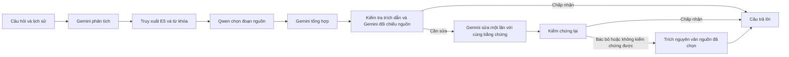

# Workflow agent cho chatbot pháp lý thuê trọ

Chatbot dùng các vai trò theo thứ tự cố định để trả lời từ nguồn có sẵn và trình bày dễ đọc:



## Các vai trò

- `question_analysis`: Gemini lập truy vấn tìm kiếm, nhóm chủ đề và dữ kiện tình huống còn thiếu. Kết quả này được truyền cho bước tổng hợp, không dùng làm căn cứ pháp luật.
- `legal_retrieval`: lấy tài liệu từ kho cấu hình bằng E5 và từ khóa, giữ rank/metadata/điều kiện nguồn.
- `evidence_selection`: Qwen chỉ chọn ID đoạn có sẵn. Ứng dụng xác nhận đoạn nằm nguyên văn trong nguồn và giữ điều kiện/ngoại lệ cùng giới hạn bao phủ.
- `answer_synthesis`: Gemini nhận câu hỏi gốc, kế hoạch phân tích và đúng các nguồn đã chọn. JSON đầu ra có kết luận, tối đa năm bước, giới hạn và tối đa hai câu hỏi bổ sung. Ứng dụng gắn trích dẫn, không cho dùng rank ngoài nguồn được chọn.
- `source_verification`: kiểm tra quy tắc và đối chiếu ngữ nghĩa từng ý với nguồn riêng; kiểm tra cả kết luận không gắn trích dẫn. Bản viết bị bác bỏ được sửa tối đa một lần, không gọi lại Qwen chỉ để viết đẹp hơn.

Đầu ra tổng hợp có `generation_provider=gemini-agent`. Đây là câu trả lời Gemini viết dựa trên bằng chứng Qwen đã chọn. Khi quay về đoạn nguồn, provider cuối cùng là `qwen-local`; trace vẫn lưu các bước tổng hợp/kiểm chứng đã thử.

## Cấu hình

Đặt trong `.env` của môi trường chạy; khóa thật chỉ nằm trong cấu hình runtime:

```dotenv
CHATBOT_AGENTS_ENABLED=true
CHATBOT_ANSWER_SYNTHESIS_ENABLED=true
CHATBOT_QUESTION_ANALYSIS_MODEL=gemini-3.8-flash-high
CHATBOT_ANSWER_SYNTHESIS_MODEL=gemini-3.8-flash-high
CHATBOT_ANSWER_SYNTHESIS_TIMEOUT_SECONDS=60
OLLAMA_MODEL=qwen3.5:9b
GEMINI_BASE_URL=http://127.0.0.1:8317/v1beta
GEMINI_DOCKER_BASE_URL=http://host.docker.internal:8317/v1beta
```

Model trên là alias proxy đã cấu hình cho dự án; có thể thay bằng model mà endpoint của môi trường cung cấp. Nếu `CHATBOT_ANSWER_SYNTHESIS_MODEL` rỗng, dùng `GEMINI_MODEL`.

- `CHATBOT_AGENTS_ENABLED=false`: luồng một provider như trước.
- `CHATBOT_AGENTS_ENABLED=true`, `CHATBOT_ANSWER_SYNTHESIS_ENABLED=false`: Gemini phân tích và Qwen trích nguyên văn, phục vụ so sánh với lượt cũ.
- Cả hai bằng `true`: workflow phân tích → chọn bằng chứng → tổng hợp → kiểm chứng.

Workflow này áp dụng cho nhánh câu hỏi pháp lý. Nhánh tìm/so sánh tin trọ vẫn dùng cơ chế provider hiện có. Không đưa bộ đáp án tham chiếu vào prompt trả lời hoặc kho nguồn chỉ để đạt mức khớp.

## Lỗi và giới hạn

Nếu phân tích lỗi, dùng định tuyến chủ đề dự phòng. Nếu Qwen không chọn được nguồn, dùng phản hồi thiếu căn cứ theo cơ chế chatbot. Nếu Gemini viết lỗi, JSON không hợp lệ, dùng rank ngoài nguồn hoặc không qua kiểm chứng sau một lần sửa, trả lại trích đoạn đã chọn. Giới hạn nguồn và trạng thái thiếu căn cứ không bị bước viết xóa đi.

Trace được gắn với từng kết quả, không lưu trạng thái riêng của câu hỏi trên agent dùng chung. Các client HTTP được đóng khi API tắt. `exact_source_match` xác nhận đầu ra trích nguyên văn; trạng thái này không xác minh hiệu lực pháp luật hoặc cách áp dụng vào một vụ việc riêng.

## Kiểm thử và đánh giá

`apps/api/tests/test_agent_workflow.py` kiểm tra luồng đủ vai trò, giới hạn rank, giữ trạng thái trả lời một phần, lỗi JSON/proxy, sửa một lần, dùng lại nguồn và không tích lũy trace giữa các câu hỏi.

Runner `eval/question_bank_ragas.py` ghi riêng cấu hình tổng hợp, trace gọi Gemini và pipeline hash. Dùng tên output mới khi thay đổi pipeline. Có thể chạy lại cùng 36 câu trong `docs/LEGAL_QUESTION_BANK.md`; các điểm RAGAS bám context và đối chiếu đáp án tham chiếu là hai phần đánh giá riêng.

Prompt tổng hợp và kiểm chứng chứa schema JSON vì proxy tương thích có thể bỏ qua `responseJsonSchema`. Ứng dụng vẫn xác nhận kiểu dữ liệu, rank và nội dung sau khi nhận; verdict kiểm chứng sai kiểu không được chấp nhận. Các kiểm thử chatbot/pháp lý liên quan đã qua: **115 passed**. Giao diện đã qua build, lint và kiểm tra TypeScript trong Next.js production build.

Sau khi đủ 36 câu, tạo bảng vận hành và đối chiếu nguyên văn bốn bộ đáp án bằng:

```powershell
python eval/report_agent_workflow.py --run eval/reports/legal_agent_synthesis_36_2026-10-04.json --output eval/ragas_reports/legal_agent_workflow_36_2026-10-04
```

Script từ chối lượt chưa đủ 36 câu. A/B là các lượt chatbot cũ, C là đáp án bạn cung cấp, D là workflow agent mới; việc đặt cạnh nhau không tự chấm độ đúng pháp luật. Các file `smoke*` và `trial` là lượt phát triển với pipeline khác, không cộng vào kết quả 36 câu cuối.

Lượt cuối ngày 04/10/2026 đã hoàn tất **36/36 câu, không có lỗi thu thập**: 28 câu giữ bản tổng hợp Gemini, 8 câu dùng lại trích nguồn sau kiểm chứng/sửa. Gemini phân tích thành công 31 câu; 5 câu dùng định tuyến dự phòng. Có 13 câu gọi sửa writer, không có lỗi định dạng writer trong lượt cuối. Vẫn có 22 câu trả lời một phần theo cờ của hệ thống.

Trung vị độ trễ là 43,4 giây và độ dài 1.299 ký tự; lượt B cũ tương ứng 30,7 giây và 2.473 ký tự. Đây là quan sát trên các lượt khác thời điểm, chưa đo độ đúng pháp luật hoặc kết luận cấu hình tối ưu. Mã chatbot trong API triển khai có cùng pipeline hash với lượt đánh giá.

[Báo cáo và nguyên văn 144 đáp án A/B/C/D](../eval/ragas_reports/legal_agent_workflow_36_2026-10-04.md) · [Dữ liệu lượt 36 câu](../eval/reports/legal_agent_synthesis_36_2026-10-04.json).

Kiểm tra endpoint API đang chạy với tài khoản sẵn có nhận **HTTP 200**, provider `gemini-agent`, đủ các vai trò phân tích/truy xuất/chọn nguồn/tổng hợp/kiểm chứng; độ trễ 50,2 giây. [Kết quả HTTP](../eval/reports/legal_agent_synthesis_http_2026-10-04.json) không chứa token đăng nhập hoặc khóa model.

Để triển khai cục bộ sau khi sửa `.env`:

```powershell
docker compose -f docker-compose.yml -f docker-compose.override.yml up -d --build api
```
